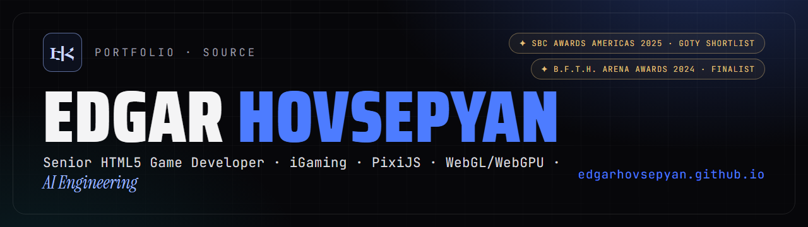
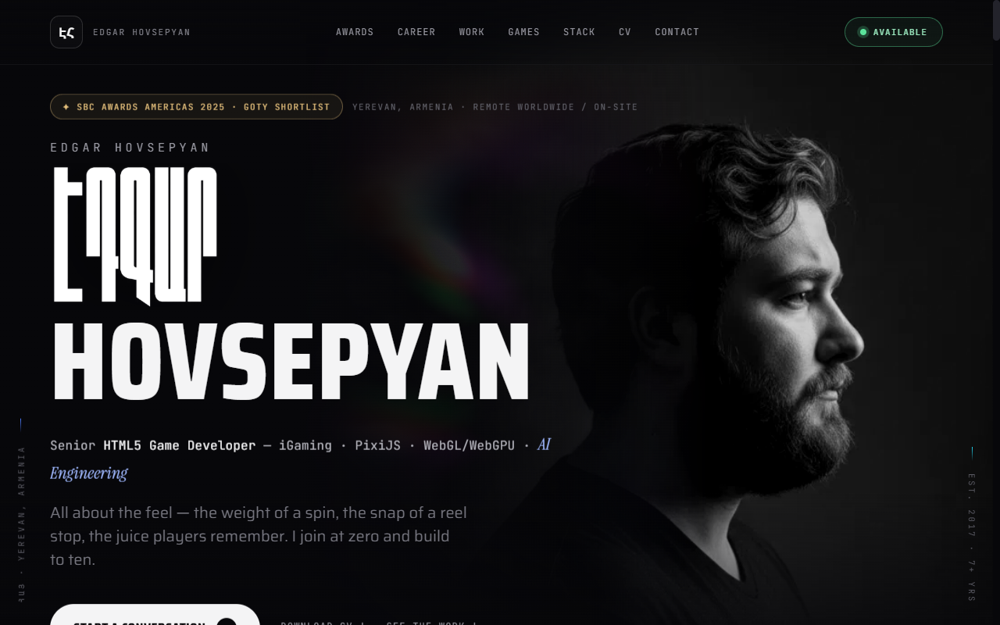
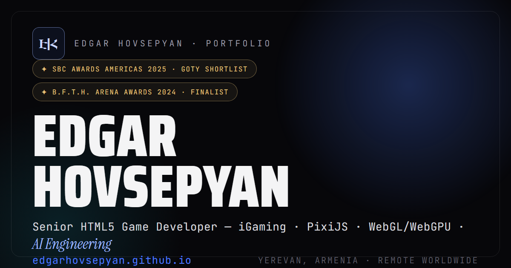

<!-- ══════════════════════════════════════════════════════════════ -->
<!--                          H E R O                               -->
<!-- ══════════════════════════════════════════════════════════════ -->

<div align="center">

<a href="https://edgarhovsepyan.github.io/">
  
</a>

<br /><br />

<h1>Edgar&nbsp;Hovsepyan</h1>

<h3>Senior HTML5 Game Developer&nbsp;·&nbsp;iGaming&nbsp;&nbsp;|&nbsp;&nbsp;AI-Powered Creative Game Developer</h3>

<p>
  <b>Blank canvas → regulator-ready.</b> 7+ years shipping premium casino titles that hit
  <b>120&nbsp;fps win-ceremonies on mobile</b>.<br />
  This repo is the source code of my portfolio — a hand-built React&nbsp;19&nbsp;+&nbsp;WebGL site with zero UI framework.
</p>

<!-- ── location / status ── -->
<p>
  
  
  
  
</p>

<!-- ── contact / hire row (clickable) ── -->
<p>
  <a href="https://edgarhovsepyan.github.io/">
    
  </a>
  <a href="https://edgarhovsepyan.github.io/Edgar_Hovsepyan_CV.pdf">
    
  </a>
  <a href="https://www.linkedin.com/in/edgar-hovsepyan-03044117b">
    
  </a>
  <a href="https://t.me/Dev_context">
    
  </a>
  <a href="mailto:edgarhovsepyan94@gmail.com">
    
  </a>
</p>

</div>

<br />

---

<!-- ══════════════════════════════════════════════════════════════ -->
<!--                      R E C O G N I T I O N                     -->
<!-- ══════════════════════════════════════════════════════════════ -->

<div align="center">

### 🏆 &nbsp;Recognition


&nbsp;


<b>Non-Stop Roulette</b> · Pascal Gaming — shortlisted for <b>Game of the Year</b> at the SBC Awards Americas 2025.<br />
<b>B.F.T.H. Arena Awards 2024</b> — Finalist.

</div>

<br />

<!-- ══════════════════════════════════════════════════════════════ -->
<!--                       S C R E E N S H O T                      -->
<!-- ══════════════════════════════════════════════════════════════ -->

<div align="center">

<a href="https://edgarhovsepyan.github.io/">
  
</a>

<br />
<sub><b>Live hero</b> — cinematic scroll-out parallax over a real-time three.js shader set-piece. <a href="https://edgarhovsepyan.github.io/">See it move →</a></sub>

</div>

<br />

---

<!-- ══════════════════════════════════════════════════════════════ -->
<!--                     P R O   C R A F T                          -->
<!-- ══════════════════════════════════════════════════════════════ -->

<div align="center">

### 🎰 &nbsp;What I ship for a living

<sub>The engine room behind 50+ shipped titles — the flavour this portfolio is built to prove.</sub>

<br /><br />


</div>

<br />

#### What I bring

- 🎰 **50+ HTML5 casino titles** shipped end-to-end — blank canvas to regulator-ready.
- 🏆 **SBC Awards Americas 2025 — Game of the Year shortlist** (Non-Stop Roulette, Pascal Gaming) · **B.F.T.H. Arena Awards 2024 — Finalist**.
- ⚡ **120 fps win-ceremonies on mobile** — hand-tuned render loops and VFX budgets.
- 🤝 **Mentors mid & junior developers** and raises the bar for the whole team.
- 🤖 **Builds the team's Claude Code + MCP AI build pipelines** — automation that compounds.
- 🌍 **Yerevan, Armenia** — available remote worldwide or on-site.

<br />

<!-- ══════════════════════════════════════════════════════════════ -->
<!--                     B Y   T H E   N U M B E R S                -->
<!-- ══════════════════════════════════════════════════════════════ -->

<div align="center">

### 📊 &nbsp;By the numbers

<table>
  <tr>
    <td align="center"><h2>7+</h2></td>
    <td align="center"><h2>50+</h2></td>
    <td align="center"><h2>2025</h2></td>
    <td align="center"><h2>120 fps</h2></td>
  </tr>
  <tr>
    <td align="center"><sub>Years shipping<br />iGaming</sub></td>
    <td align="center"><sub>HTML5 casino titles<br />shipped end-to-end</sub></td>
    <td align="center"><sub>SBC Awards Americas<br />GOTY shortlist</sub></td>
    <td align="center"><sub>Win-ceremonies<br />on mobile</sub></td>
  </tr>
</table>

</div>

<br />

---

<!-- ══════════════════════════════════════════════════════════════ -->
<!--                    F E A T U R E   G R I D                     -->
<!-- ══════════════════════════════════════════════════════════════ -->

<div align="center">

### ✨ &nbsp;Inside this codebase

<sub>Everything below is hand-rolled — <b>no UI framework, no component library, no template.</b></sub>

</div>

<br />

<table>
<tr>
<td width="50%" valign="top">

#### 🌌 &nbsp;Two WebGL set-pieces
Real-time **three.js + GLSL** shader scenes, choreographed to scroll with **GSAP ScrollTrigger**. Cinematic, not decorative.

</td>
<td width="50%" valign="top">

#### 🪄 &nbsp;A full motion system
Scroll-reveal · text-scramble · count-up stats · magnetic buttons · cursor spotlight · custom cursor · directional reveals · scroll-scrub marquee.

</td>
</tr>
<tr>
<td width="50%" valign="top">

#### 🎬 &nbsp;Cinematic hero
A scroll-out **parallax** that dissolves the hero as you descend — the kind of choreography I build for win-ceremonies, applied to a page.

</td>
<td width="50%" valign="top">

#### 🔋 &nbsp;Render-gated by default
Every WebGL effect **pauses off-screen and when the tab is hidden**. The GPU sleeps when you're not looking. Battery-friendly by design.

</td>
</tr>
<tr>
<td width="50%" valign="top">

#### ♿ &nbsp;Accessible & respectful
Honours **`prefers-reduced-motion`** everywhere, is **iOS safe-area** aware, and guarantees **zero horizontal overflow** on mobile.

</td>
<td width="50%" valign="top">

#### 🔍 &nbsp;SEO & social ready
**Person JSON-LD**, OG / Twitter cards, `sitemap.xml`, `robots.txt` — plus **GA4** analytics, guarded so it never runs where it shouldn't.

</td>
</tr>
<tr>
<td width="50%" valign="top">

#### 🎨 &nbsp;Design tokens, no framework
**CSS Modules + design tokens** — a single source of truth for colour, type and spacing. No Tailwind, no Bootstrap, no bloat.

</td>
<td width="50%" valign="top">

#### 🚀 &nbsp;Ships itself
**GitHub Actions → GitHub Pages** (Node 22, self-enabling) with **Vercel** git integration as a mirror. Push to `main`, it's live.

</td>
</tr>
</table>

<br />

---

<!-- ══════════════════════════════════════════════════════════════ -->
<!--                     T E C H   S T A C K                        -->
<!-- ══════════════════════════════════════════════════════════════ -->

<div align="center">

### 🧬 &nbsp;The stack that renders this site

<br />


</div>

<br />

| Layer | Choice | Why it's here |
| :--- | :--- | :--- |
| 🖼️ **UI** | React 19 + TypeScript (strict) | Type-safe components, zero UI framework — every pixel is intentional |
| ⚡ **Build** | Vite 6 | Instant HMR in dev, lean, tree-shaken production bundle |
| 🌌 **WebGL** | three.js | Two custom shader set-pieces, render-gated for battery & thermals |
| 🎞️ **Motion** | GSAP + ScrollTrigger | Scroll-scrubbed timelines, the same craft I bring to win-ceremonies |
| 🎨 **Styling** | CSS Modules + design tokens | One source of truth for colour / type / spacing — no framework |
| 🔍 **Discovery** | JSON-LD · OG/Twitter · sitemap · robots | Recruiters and crawlers both land somewhere polished |
| 📊 **Analytics** | GA4 (guarded) | Measured, privacy-conscious, never fires in the wrong context |
| 🚀 **Delivery** | GitHub Actions → Pages · Vercel | Node 22 self-enabling pipeline, push-to-deploy |

<br />

---

<!-- ══════════════════════════════════════════════════════════════ -->
<!--            P E R F   ·   G A T I N G   ·   A 1 1 Y             -->
<!-- ══════════════════════════════════════════════════════════════ -->

### 🛡️ &nbsp;Performance · Render-Gating · A11y — by contract

| Guarantee | How it's enforced |
| :--- | :--- |
| 🔋 **No off-screen GPU work** | WebGL set-pieces observe visibility and **pause when scrolled out of view** |
| 🙈 **No background-tab burn** | Render loops halt on `visibilitychange` when the **tab is hidden** |
| 🧠 **Motion is optional** | Every animation branches on **`prefers-reduced-motion`** and degrades gracefully |
| 📱 **Notch-safe layout** | **iOS safe-area insets** respected across hero, nav and footer |
| ↔️ **No mobile overflow** | **Zero horizontal scroll** guaranteed on small viewports |
| 🔤 **No layout shift on fonts** | Fonts load with **`font-display: swap`** + **`preconnect`** so text paints instantly |
| 📊 **Analytics never blocks** | **GA4 is guarded** — absent config means it simply never loads |

<br />

---

<!-- ══════════════════════════════════════════════════════════════ -->
<!--                     Q U I C K   S T A R T                      -->
<!-- ══════════════════════════════════════════════════════════════ -->

### ⚡ &nbsp;Run it locally

> **Prerequisite:** Node **22.x** (pinned in `package.json` → `engines`). No environment variables are needed to run the site locally.

```bash
# 1 · clone
git clone https://github.com/EdgarHovsepyan/EdgarHovsepyan.github.io.git
cd EdgarHovsepyan.github.io

# 2 · install (Node 22.x)
npm install

# 3 · dev server — Vite HMR
npm run dev

# 4 · production build (type-check + bundle)
npm run build

# 5 · preview the production build locally
npm run preview
```

<details>
<summary><b>📜 &nbsp;All npm scripts</b></summary>

<br />

| Script | Command | Purpose |
| :--- | :--- | :--- |
| `dev` | `vite` | Dev server with hot-module replacement |
| `build` | `tsc -b && vite build` | Type-check the project references, then bundle to `dist/` |
| `preview` | `vite preview` | Serve the production build locally |
| `typecheck` | `tsc -b --noEmit` | Strict type-check with no emit |

</details>

<br />

---

<!-- ══════════════════════════════════════════════════════════════ -->
<!--                  A R C H I T E C T U R E                       -->
<!-- ══════════════════════════════════════════════════════════════ -->

### 🏗️ &nbsp;Architecture snapshot

The codebase is organized by intent — **effects** (the atmosphere), **sections** (the page), **ui** (the primitives), and a clean **data / hooks / utils** split so content and behaviour stay separate.

<details>
<summary><b>Project structure</b> — click to expand</summary>

<br />

```text
EdgarHovsepyan.github.io/
├─ .github/
│  ├─ media/                      # banner + live-site preview for this README
│  └─ workflows/deploy.yml        # GitHub Actions → Pages (Node 22, self-enabling)
├─ public/
│  ├─ assets/og-image.png         # 1200×630 dark social card
│  ├─ fonts/                      # WOFF2 fonts used by the print-CV pages
│  ├─ cv/                         # CV assets
│  ├─ sitemap.xml · robots.txt    # SEO surface
│  └─ Edgar_Hovsepyan_CV.pdf      # live résumé
├─ src/
│  ├─ components/
│  │  ├─ effects/     Background · CursorSpotlight · CustomCursor
│  │  │               Grain · Preloader · ScrollProgress
│  │  ├─ layout/      Nav · Footer · SideRails
│  │  ├─ sections/    Hero · Profile · Expertise · Games · Work · Awards
│  │  │               Timeline · StatsBand · Marquee · Resume · Contact
│  │  │               ShaderBand · ExtraStudio
│  │  └─ ui/          Reveal · Counter · Chip · SectionHeader
│  │                  shader-lines · turbulent-flow   ← the two WebGL set-pieces
│  ├─ hooks/          useInView · useParallax · useParallaxVar · useScrollProgress
│  │                  useScrollScrub · useScramble · useMagnetic · useTilt
│  │                  useReducedMotion
│  ├─ data/           typed content: profile · experience · expertise · games
│  │                  work · stats · contact · navigation · marquee · types
│  ├─ styles/         global.css + design tokens
│  └─ utils/          cx (className helper)
├─ index.html                     # OG / Twitter meta + Person JSON-LD
├─ vite.config.ts · tsconfig*.json
└─ vercel.json                    # Vercel git-integration mirror
```

</details>

<sub><b>Design principle:</b> content lives in typed <code>src/data/*</code> modules, presentation lives in <code>components/</code>, and behaviour lives in composable <code>hooks/</code> — so sections stay declarative and swap content without touching motion code.</sub>

<br />

#### Delivery pipeline

```text
push → main
   └─ GitHub Actions (Node 22)
        ├─ npm ci
        ├─ tsc -b        # strict typecheck
        ├─ vite build    # bundle → dist/
        └─ deploy → GitHub Pages   (Pages auto-enabled via API on first run)

   └─ Vercel git integration  → preview + production, in parallel
```

<br />

<!-- ══════════════════════════════════════════════════════════════ -->
<!--                   U N D E R   T H E   H O O D                  -->
<!-- ══════════════════════════════════════════════════════════════ -->

<details>
<summary><b>🔬 &nbsp;Under the hood — the engineering I'm quietly proud of</b></summary>

<br />

**🔋 Render-gating (never burn a GPU cycle off-screen)**
Every WebGL scene subscribes to an `IntersectionObserver` and the Page Visibility API. Scroll a scene out of
view — or switch tabs — and its `requestAnimationFrame` loop halts, the renderer stops drawing, and the GPU
idles. Scroll back and it resumes seamlessly. This is the same discipline that keeps 120 fps win-ceremonies
cool on mobile.

**♿ Reduced-motion is a first-class path, not a fallback**
`prefers-reduced-motion: reduce` doesn't just soften animations — it swaps timelines for static, meaningful
end-states. Nothing important is *only* communicated through motion.

**📱 Mobile that actually behaves**
`env(safe-area-inset-*)` is respected on notched iOS, and a hard rule of **zero horizontal overflow** — the
page body never scrolls sideways; wide content scrolls inside its own container.

**🎞️ Scroll as a timeline**
GSAP ScrollTrigger pins and scrubs the horizontal *Work* gallery, while lightweight rAF-throttled hooks drive
the hero scroll-out parallax, the scroll-scrub marquee and the directional reveals. Everything stays in step
with the scroll position using **transform & opacity only** — no jank, no layout thrash.

**🔍 SEO you can inspect**
`Person` JSON-LD structured data, full Open Graph + Twitter card meta, a `sitemap.xml` and `robots.txt`. Share
the URL anywhere and it unfurls into a proper dark social card.

**📊 Analytics with a seatbelt**
GA4 is guarded — it only initialises in the right environment and stays silent everywhere else. Measurement
without leakage.

**🚀 CI/CD that enables itself**
A GitHub Actions workflow builds on **Node 22** and deploys to GitHub Pages, self-enabling the Pages
environment on first run. Vercel's git integration mirrors the same commits — belt and braces.

</details>

<br />

---

<!-- ══════════════════════════════════════════════════════════════ -->
<!--                         H I R E   M E                          -->
<!-- ══════════════════════════════════════════════════════════════ -->

<div align="center">



<br /><br />

## 👋 &nbsp;Let's build something that ships at 120 fps

<p>
  I take iGaming titles from <b>blank canvas to regulator-ready</b> — deterministic physics, Spine VFX,
  hand-tuned GLSL/WGSL shaders, and the pipelines that let a small team move like a big one.<br />
  <b>Open to senior HTML5 / iGaming roles — remote worldwide or on-site.</b> The fastest way to reach me is below. 👇
</p>

<p>
  <a href="https://edgarhovsepyan.github.io/">
    
  </a>
  <a href="https://edgarhovsepyan.github.io/Edgar_Hovsepyan_CV.pdf">
    
  </a>
  <a href="https://github.com/EdgarHovsepyan">
    
  </a>
</p>
<p>
  <a href="https://www.linkedin.com/in/edgar-hovsepyan-03044117b">
    
  </a>
  <a href="https://t.me/Dev_context">
    
  </a>
  <a href="mailto:edgarhovsepyan94@gmail.com">
    
  </a>
</p>

<br />

<sub>Designed, engineered and shipped in Yerevan, Armenia 🇦🇲 with React&nbsp;19, TypeScript, Vite, three.js & GSAP — by <b>Edgar Hovsepyan</b>.</sub>

</div>

